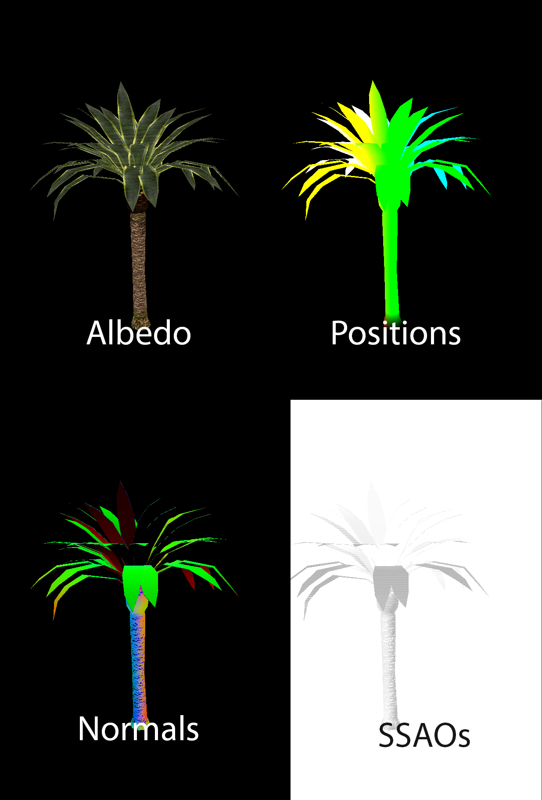

# SuSto Engine QT

Creators: Simon Stoyanov and Guillem Sunyer.

This is a small 3D engine made using QT for the Advanced graphics programming subject.

Use workflow: Load model using the File/LoadModel button located on the top menu of the application. To 
see the model on the scene, a light is needed. To do this, create a new entity, and add a light component. Now the model is
shown. Use WASD to move the camera thorugh the scene.

You can swap the different render modes using the drop down located on the Render window.

Screenshoots:

