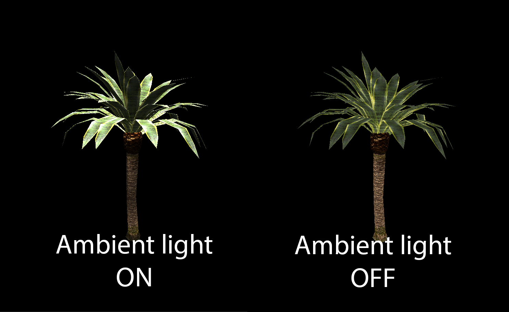

# SuSto Engine QT

In this release, the user can do the next things with entities:
* Create
* Delete
* Rename
* Add Component 
* Duplicate

Entities have a component system, with the next implemented components:
* Transform
	- Position
	- Rotation
	- Scale
* Shape Renderer:
	- Change between Circle or  Quad
	- Change the size of the shape
	- Change the size of stroke
	- Strok style
	- Stroke colour
	- Change colour of the shape
	
Use workflow: Load model using the File/LoadModel button located on the top menu of the application. To 
see the model on the scene, a light is needed. To do this, create a new entity, and add a light component. Now the model is
shown. Use WASD to move the camera thorugh the scene.

You can swap the different render modes using the drop down located on the Render window.

Screenshoots:

